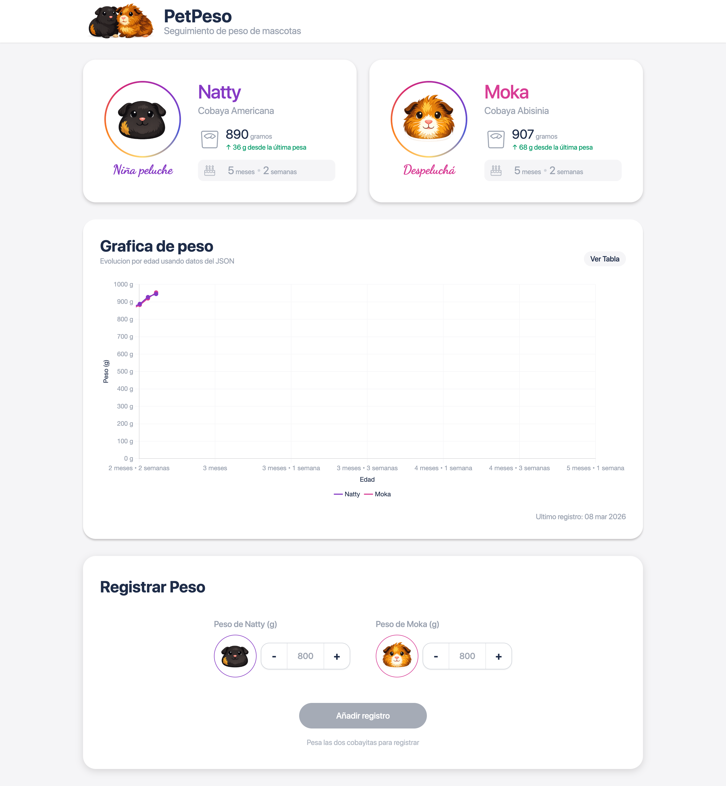
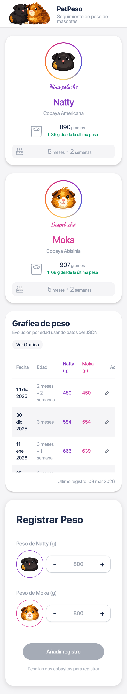

# PetPeso

PetPeso is a pet weight tracking app built with Vue 3 + Vite, with JSON persistence handled by a small PHP API.

The name "PetPeso" means "Pet's Weight".

It is a small focused web app with a very concrete goal: register pet weights and visualize the data in both a table and a chart.

It is also designed to be lightweight and easy to upload to a classic FTP/shared-hosting environment, which is why it uses a simple frontend build plus a small PHP + JSON backend instead of a heavier stack.

The project is structured with scalability in mind:

- new pets can be added from `data/pets.json`
- reusable components make UI growth easier
- data operations are centralized in `api/weights.php`
- the current JSON storage can be replaced later by a real database or stronger backend auth if needed

Note: the sample data is currently written in Spanish.

## Stack

- Vue 3
- Vite
- Tailwind CSS v4
- Chart.js
- PHP
- JSON file storage

## Screenshots

Screenshots are stored in `public/docs`:

- `public/docs/screenshot_desktop.png`
- `public/docs/screenshot_mobile.png`

Preview:

<p align="left">
  
  
</p>
<p align="left">
  <strong>Desktop</strong>
  &nbsp;&nbsp;&nbsp;&nbsp;&nbsp;&nbsp;&nbsp;&nbsp;&nbsp;&nbsp;&nbsp;&nbsp;&nbsp;&nbsp;&nbsp;&nbsp;&nbsp;&nbsp;&nbsp;&nbsp;&nbsp;&nbsp;&nbsp;&nbsp;&nbsp;&nbsp;&nbsp;&nbsp;&nbsp;&nbsp;&nbsp;&nbsp;&nbsp;&nbsp;&nbsp;&nbsp;&nbsp;&nbsp;&nbsp;&nbsp;&nbsp;&nbsp;&nbsp;&nbsp;&nbsp;&nbsp;
  <strong>Mobile</strong>
</p>

## Important structure

- `src/`: frontend app
- `api/weights.php`: API to read, create, edit, and delete records
- `data/pets.json`: pet configuration
- `data/weights-history.json`: weight history

`data/` is the single source of truth for pets and weight records.

## Scripts

```sh
npm install
npm run dev
npm run dev:api
npm run dev:full
npm run build
npm run lint
npm run e2e:data
```

## Local development

### 1. Environment variables

Create your `.env` from `.env.example`.

Available variables:

- `VITE_API_BASE_URL`: only used in local development through the Vite proxy. Usually `http://localhost:8000`
- `VITE_WEIGHT_API_TOKEN`: optional token to protect `POST`, `PUT`, and `DELETE`
- `VITE_ACTION_PASSWORD`: password used by the UI popup before add, edit, and delete actions

To change the UI password, set a different value for:

```sh
VITE_ACTION_PASSWORD=your-password
```

Important:

- all `VITE_...` variables are exposed in the frontend bundle
- `VITE_ACTION_PASSWORD` is not real security, only a convenience gate
- real write protection depends on `WEIGHT_API_TOKEN` in PHP
- this app is designed for personal use and does not store important or sensitive data, so the password popup is intentionally frontend-only

### 2. Run frontend and API

In one command:

```sh
npm run dev:full
```

Or separately:

```sh
npm run dev
npm run dev:api
```

Local URLs:

- frontend: `http://localhost:5173`
- PHP API: `http://localhost:8000/api/weights.php`

In development, Vite proxies `/api` to `VITE_API_BASE_URL` or to `http://localhost:8000`.

## API

Main file:

- `api/weights.php`

Supported endpoints:

- `GET /api/weights.php`
- `POST /api/weights.php`
- `PUT /api/weights.php?id=123`
- `DELETE /api/weights.php?id=123`

Important behavior:

- reads and writes `data/weights-history.json`
- validates the `weightKey` values defined in `data/pets.json`
- tolerates UTF-8 BOM in JSON files to avoid common FTP/editor issues
- uses `WEIGHT_API_TOKEN` if it exists in the PHP environment

## FTP deployment

The app is configured with base path `/petpeso/`, so the frontend expects to be published there.

### Option 1: deploy from `dist/`

1. Build the frontend:

```sh
npm run build
```

This command generates the production frontend inside:

- `dist/`

After building, `dist/` contains the compiled frontend files, including:

- `index.html`
- `assets/`

2. Upload these files/folders to the hosting target:

- all contents of `dist/`
- `api/`
- `data/`

In other words, the FTP deployment needs these frontend and backend parts together:

- `dist/index.html` and `dist/assets/...`
- `api/weights.php`
- `data/pets.json`
- `data/weights-history.json`

3. Make sure PHP can write to:

- `data/weights-history.json`

4. If you want backend write protection, configure this on the host:

```sh
WEIGHT_API_TOKEN=your-token
```

And build the frontend with:

```sh
VITE_WEIGHT_API_TOKEN=your-token
```

5. If you want the UI password popup:

```sh
VITE_ACTION_PASSWORD=your-password
```

## Data

### `data/pets.json`

Each pet defines at least:

- `id`
- `name`
- `birthday`
- `primaryColor`
- `photo`
- `formPhoto`
- `backPhoto`
- `weightKey`

### `data/weights-history.json`

Each record stores:

- `id`
- `date`
- `age`
- one weight field for every configured `weightKey`

## Current UX

- add, edit, and delete actions go through a password popup
- successful add, edit, and delete actions show a snackbar
- each pet avatar remembers the selected side for the current browser session
- weight inputs use custom `- / +` controls with `100g` steps

## Quality checks

Recommended checks:

```sh
npm run lint
npm run build
```

## Notes

- `VITE_ACTION_PASSWORD` does not replace real authorization
- if production shows an empty table, first check `api/weights.php`, `data/pets.json`, and `data/weights-history.json` on the server
- if you upload through FTP and still see old behavior, remove old assets before uploading again
